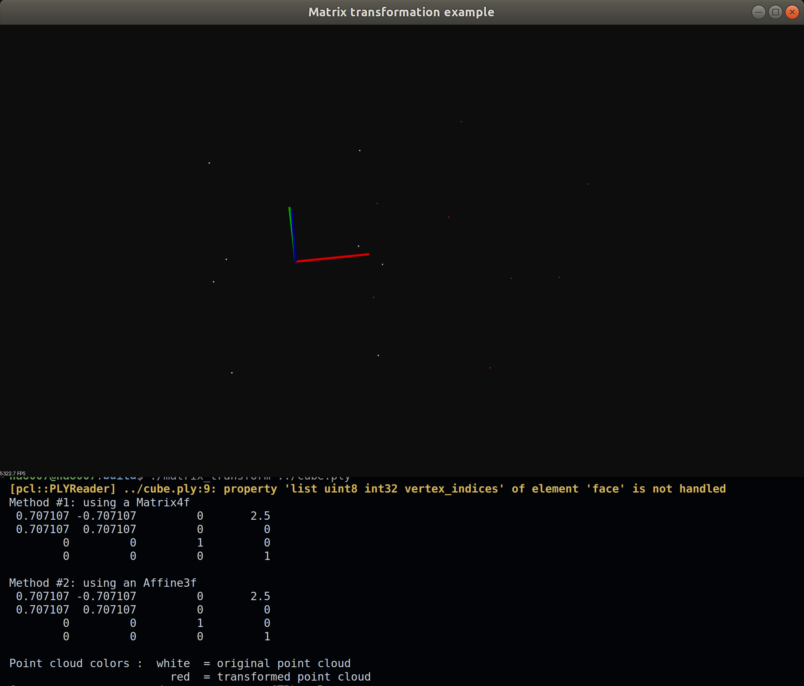

# pcl学习手册
## 00 2022-12-18
push && del on hao007

## 12.15 更新

一个比较简单的NDT例子 **NDT_PCL_demo-master**

/home/hao007/pcl-learning/NDT_PCL_demo-master/normal_distributions_transform.cpp

## 运行示例

### 00 pcd_write

写5个点到一个pcd文件中，生成test_pcd.pcd文件

```
mkdir build
cd build
cmake ..
make
./pcd_write 
```

### 01 matrix_transform

```
mdkir build
cd build
cmake ..
make
./matrix_transform ../cube.ply
```



### 02 kdtree

KD-tree理论

kd树在选择特征作为切分时是以最大方差来作为标准，这样可以保证每个维度的切分都是最优的。
kd树是一个二叉树结构，它的每一个节点记载了【特征坐标，切分轴，左指针，右指针】。

k-d树（k-dimensional树的简称），是一种分割k维数据空间的数据结构。主要应用于多维空间关键数据的搜索（如：范围iesousuo和最近邻搜索）

**理解1：**
K-D树算法可以分为两大部分，一部分是有关k-d树本身这种数据结构建立的算法，另一部分是在建立的k-d树上如何进行最近邻查找的算法。

**理解2：**
特征点匹配实际上就是一个通过距离函数在高维矢量之间进行相似性检索的问题。如何快速而准确地找到查询点的近邻，现在提出了很多高维空间索引结构和近似查询的算法。索引结构中相似性查询的算法

1. 创建kdTreeFLANN对象，并把创建的点云设置为输入，创建一个searchPoint变量作为查询点

```cpp
kdtree.setInputCloud(cloud);
pcl::PointXYZ searchPoint;
```

2. 执行搜索nearestSearch 或者 radiusSearch

```cpp
if(kdtree.nearestSearch(searchPoint,K,pointIdxNKNsearch,pointNKNSquareDistance)>0) //执行K近邻搜索
if(kdtree.radiusSearch(searchPoint,radius,pointIdxRadiusSearch,pointRadiusSquaredDistance)>0) //执行半径R内近邻搜索方法
```


```shell
mkdir build
cd build
cmake .. && make
hao007@hao007:build$ ./kdtree_search 
K nearest neighbor search at (235.074 62.8845 70.7073) with K=10
    243.517 115.136 76.8533 (squared distance: 2839.23)
    236.954 74.3516 125.829 (squared distance: 3173.37)
    205.395 101.883 100.935 (squared distance: 3315.49)
    249.808 67.4987 12.1683 (squared distance: 3665.19)
    181.367 68.8424 99.789 (squared distance: 3765.72)
    298.46 55.2779 45.4485 (squared distance: 4713.56)
    320.056 73.3333 75.0147 (squared distance: 7349.53)
    150.063 49.6959 44.0063 (squared distance: 8113.78)
    343.135 10.3959 36.452 (squared distance: 15605.6)
    151.71 163.318 65.538 (squared distance: 17063.2)
Neighbors within radius search at (235.074 62.8845 70.7073) with radius=197.836
    243.517 115.136 76.8533 (squared distance: 2839.23)
    236.954 74.3516 125.829 (squared distance: 3173.37)
    205.395 101.883 100.935 (squared distance: 3315.49)
    249.808 67.4987 12.1683 (squared distance: 3665.19)
    181.367 68.8424 99.789 (squared distance: 3765.72)
    298.46 55.2779 45.4485 (squared distance: 4713.56)
    320.056 73.3333 75.0147 (squared distance: 7349.53)
    150.063 49.6959 44.0063 (squared distance: 8113.78)
    343.135 10.3959 36.452 (squared distance: 15605.6)
    151.71 163.318 65.538 (squared distance: 17063.2)
    221.514 63.8933 205.193 (squared distance: 18271.3)
    250.528 109.808 199.881 (squared distance: 19126.4)
    220.261 204.423 59.3536 (squared distance: 20381.6)
    291.158 116.278 203.685 (squared distance: 23679.4)
    80.1004 171.635 108.343 (squared distance: 37260)
    229.937 249.419 121.349 (squared distance: 37386)
    216.603 7.72561 258.866 (squared distance: 38787.2)
```

PCL（Point Cloud Library）点云库  **个人开发环境：Ubuntu18.04**

**墙裂建议先看下：[PCL(Point Cloud Library)学习指南&资料推荐](https://zhuanlan.zhihu.com/p/268524083)**

**<font color='red'>PCL学习入门指南&代码实践(最新版)入门视频： </font> https://www.bilibili.com/video/BV1HS4y1y7AB**

**代码对应系列笔记：[PCL(Point Cloud Library)学习记录（2022）](https://www.yuque.com/huangzhongqing/pcl)**

**相关项目实战:**

* 3D-MOT(多目标检测和追踪):
  [https://github.com/HuangCongQing/3D-LIDAR-Multi-Object-Tracking/tree/kitti](https://github.com/HuangCongQing/3D-LIDAR-Multi-Object-Tracking/tree/kitti)
    * 需要学习ROS：https://github.com/HuangCongQing/ROS

* 英文官网：https://pcl.readthedocs.io/projects/tutorials/en/latest/#
  * https://pointclouds.org/
* GitHub：https://github.com/PointCloudLibrary/pcl
  * 学习基于pcl1.9.1：https://github.com/PointCloudLibrary/pcl/tree/pcl-1.9.1

## 编译过程

```shell
mkdir build
cd build
cmake .. // 对上一级进行编译
make  // 生成可执行文件命令
./executedemo  // 运行可执行文件
```

## 实战项目

不理解的地方,欢迎提issue: https://github.com/HuangCongQing/pcl-learning/issues

* 3D-MOT(多目标检测和追踪)
  * https://github.com/HuangCongQing/3D-LIDAR-Multi-Object-Tracking/tree/kitti
* 3D点云目标检测&语义分割-SOTA方法,代码,论文,数据集等
  * https://github.com/HuangCongQing/3D-Point-Clouds

## 相关链接

* 公众号：点云PCL
* https://github.com/Yochengliu/awesome-point-cloud-analysis
* https://github.com/QingyongHu/SoTA-Point-Cloud
* https://github.com/PointCloudLibrary/pcl
* 参考书籍：点云库PCL学习教程，朱德海，北京航空航天大学出版社
* Plus：ROS学习-https://github.com/HuangCongQing/ROS

**入门资料：**

- **视频**：[bilibili-PCL点云库官网教程](https://space.bilibili.com/504859351/channel/detail?cid=130387)
- **点云库PCL学习教程书籍每章总结：**[https://github.com/MNewBie/PCL-Notes](https://github.com/MNewBie/PCL-Notes)
- 百度网盘资料：

链接：[https://pan.baidu.com/s/1ziq8s_kj5QpM8eXO_d6RJg](https://pan.baidu.com/s/1ziq8s_kj5QpM8eXO_d6RJg)<br />提取码：g6ny<br />

**代码实践资料：**

- 官方各模块示例(和对应的对象函数对照着看)【英文】：[https://pcl.readthedocs.io/projects/tutorials/en/latest/#](https://pcl.readthedocs.io/projects/tutorials/en/latest/#)
- 官方各模块对应的对象和函数【英文】：
  - [https://pointclouds.org/documentation/modules.html](https://pointclouds.org/documentation/modules.html)
  - [https://pointclouds.org/](https://pointclouds.org/) 点击网站中的12宫图，没一格对应一个模块的对象函数详解
- [黑马机器人系列文档：PCL-3D点云](http://robot.czxy.com/docs/pcl/)：[http://robot.czxy.com/docs/pcl/](http://robot.czxy.com/docs/pcl/)
- [CSDN博主系列文章PCL学习(64篇)](https://www.cnblogs.com/li-yao7758258/category/954066.html)：[https://www.cnblogs.com/li-yao7758258/category/954066.html](https://www.cnblogs.com/li-yao7758258/category/954066.html)


3. https://mp.weixin.qq.com/s?__biz=MzI4OTY1MjA3Mg==&mid=2247486340&idx=1&sn=6c5f69bb37d91a343b1a1e7f6929ddae&chksm=ec2aa783db5d2e95ba4c472471267721cafafbe10c298a6d5fae9fed295f455a72f783872249&scene=178&cur_album_id=1855544495514140673#rd)


